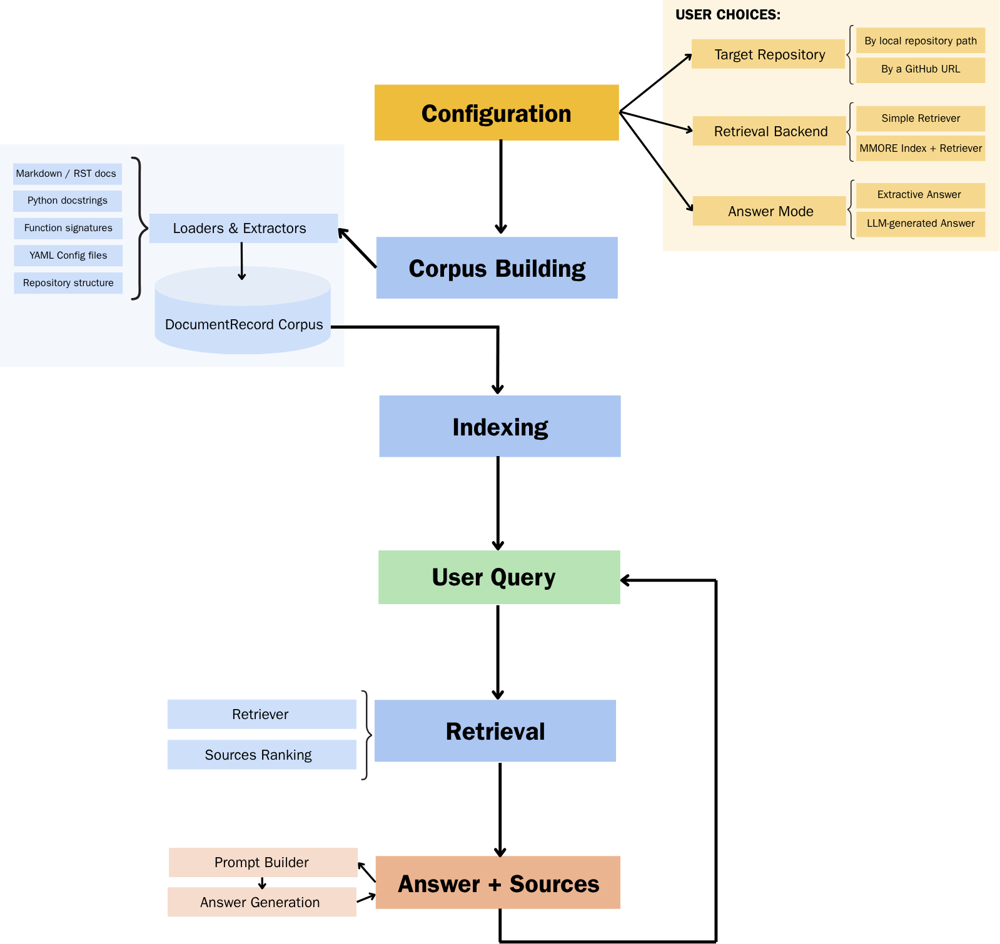

# Architecture overview

GitHelp is organized around a simple idea: all sources are converted into the same internal document format before retrieval.

The initial use case is MMORE, but the core pipeline is designed to remain project-agnostic. Project-specific behavior is isolated in optional project profiles.



## High-level flow

```text
Target project repository
        |
        |  Markdown / RST docs
        |  Python source files
        |  YAML config files
        |  repository tree
        v
GitHelp loaders and extractors
        v
DocumentRecord objects
        v
corpus.jsonl
        v
retrieval backend
        |-------------------------------|
        |                               |
        v                               v
simple retriever                MMORE retriever
(local / dynamic corpus)        (MMORE index)
        |                               |
        |-------------------------------|
        v
retrieved sources
        v
project profile
        |
        |  optional direct answer
        |  optional query expansion / filtering / reranking
        v
RAG prompt construction
        v
LLM or extractive answer
        v
answer with cited sources
```

## Main design choices

GitHelp separates the pipeline into clear blocks:

| Block | Role |
|---|---|
| `loaders/` | Load source files that are already documentation-like. |
| `extractors/` | Extract documentation from source code. |
| `corpus/` | Combine all sources into one corpus. |
| `indexing/` | Export and index the corpus with MMORE. |
| `retrieval/` | Retrieve relevant documents. |
| `project_profiles/` | Hold optional project-specific query expansion, filtering, reranking, and direct answers. |
| `rag/` | Build prompts and generate answers. |
| `projects/` | Manage selected projects, generated project configs, and persisted app state. |
| `app/` | Streamlit user interface. |

## Why keep a GitHelp format?

GitHelp uses its own `DocumentRecord` format instead of exposing MMORE everywhere.

This keeps the project modular:

- the corpus can be inspected before indexing;
- the simple retriever can run without MMORE;
- MMORE can be replaced or updated without rewriting loaders;
- retrieved sources keep consistent metadata for citations;
- Streamlit can work with project-specific corpora before MMORE indexing is available.

## Simple backend vs MMORE backend

The `simple` backend reads a selected `corpus.jsonl` directly. It is useful for:

- local development;
- direct checks of newly built project corpora;
- debugging retrieval quality;
- avoiding MMORE indexing.

The `mmore` backend is the main MMORE workflow. It retrieves from an MMORE index
when native retrieval succeeds, and it can fall back to the exported
`mmore_corpus.jsonl` if the local native process fails.

The full MMORE workflow is:

```text
Build corpus → export MMORE corpus → build MMORE index → use backend mmore
```
